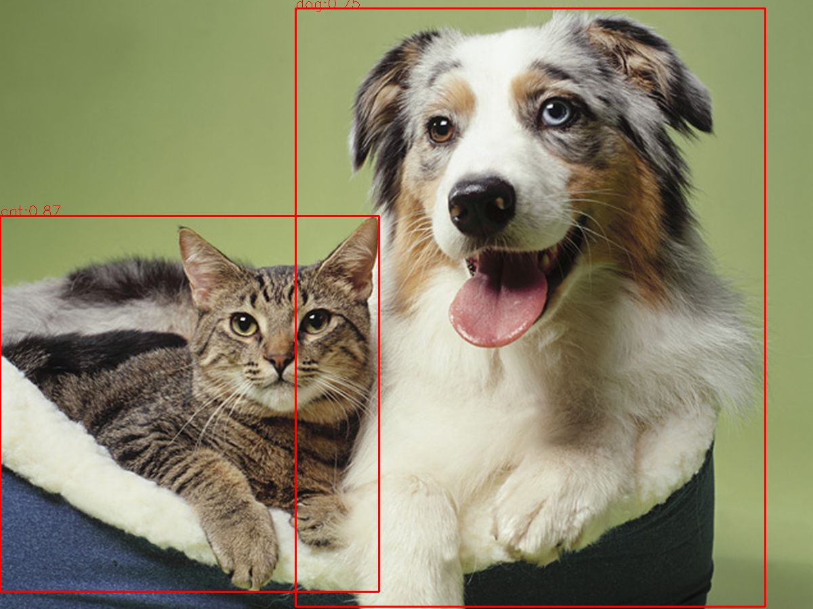
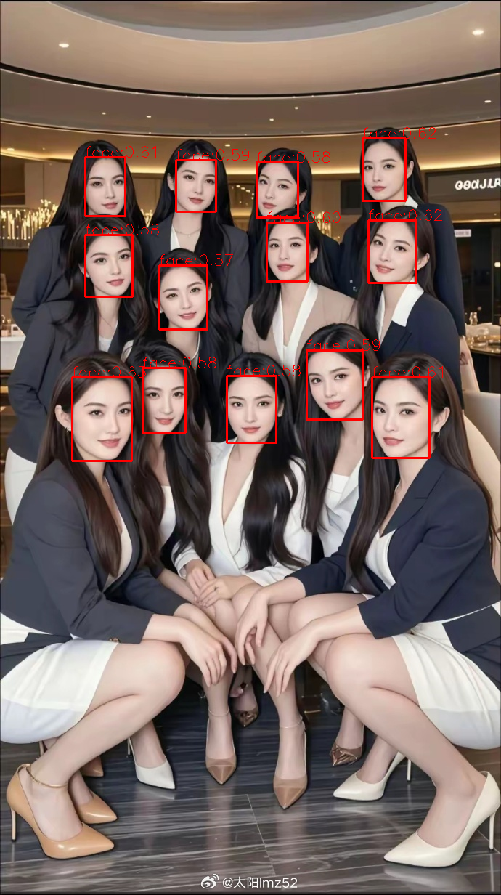
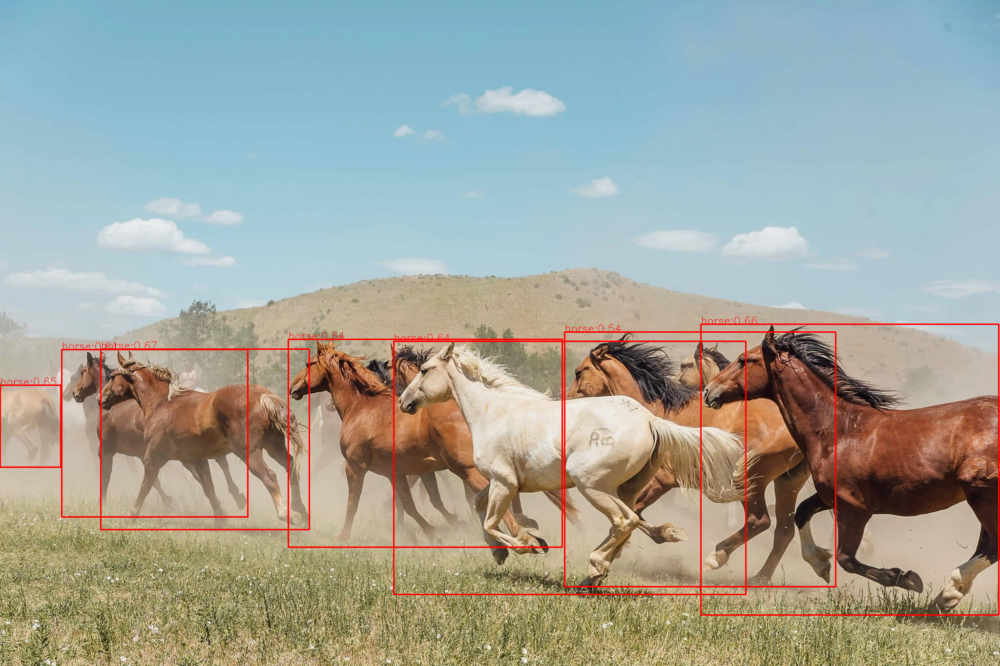

### groundingdino.cpp
#### 1. model download

baidu pan link: https://pan.baidu.com/s/1tJFjCQqqC5fbNWKtjY8bWQ 提取码: 2kch

#### 2. build
```c++
mkdir build
make -j4
```

#### 3. usage
```
./grounding_dino.cpp ../groundingdino_tiny.onnx ../images/horse.jpg  "horse" 
```

#### 4. demo
  
  
  
